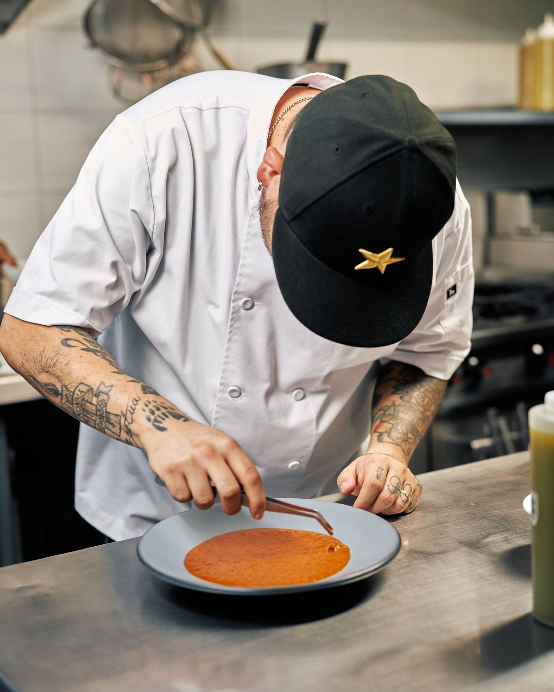

# derFlo – Private Cooking mit Florian Karrer

Statische Website für das Private-Cooking-Angebot von Florian Karrer (Marke „derFlo“, Lech am Arlberg).
Deutsch und Englisch, ohne Framework, ohne Build-Prozess, ohne externe Dienste.

## Inhalt

- [Gestalterische Richtung](#gestalterische-richtung)
- [Dateien](#dateien)
- [Lokal öffnen](#lokal-öffnen)
- [Hochladen](#hochladen)
- [Anfragehilfe (PHP-Mailversand)](#anfragehilfe-php-mailversand)
- [Fotos einsetzen](#fotos-einsetzen)
- [Bildnachweis](#bildnachweis)
- [Vor Veröffentlichung noch benötigt](#vor-veröffentlichung-noch-benötigt)
- [Was geprüft wurde](#was-geprüft-wurde)
- [Mögliche spätere Erweiterungen](#mögliche-spätere-erweiterungen)
- [Lizenzen](#lizenzen)

## Gestalterische Richtung

**Beton, Orange, schmale Versalien – die Anmutung der bestehenden derFlo-Grafik, als Website.**

- **Farben:** dunkler Beton als Grundfläche (Basis `#1a1a1a`, darüber eine gekachelte SVG-Textur `assets/img/concrete.svg`, siehe unten), helles Steingrau (`#ece7df`) für Text, das Original-Orange der Bildmarke (`#dc4114`) als einzige Akzentfarbe – für die zweite Hälfte der Headline, Nummern, Schaltflächen und feine Linien. Der Abschnitt „Über Flo“ liegt auf glattem Schwarz (`#101010`), „Einblicke“ auf leicht abgedunkeltem Beton; sonst kein Farbwechsel pro Abschnitt.
- **Betontextur:** `assets/img/concrete.svg` ist keine Fotografie, sondern eine kleine (unter 1 KB), nahtlos kachelbare Datei, die die Struktur per SVG-Filter (`feTurbulence`) erzeugt – Wolken und feines Korn. Dadurch bleibt der Hintergrund scharf auf jeder Auflösung und kostet keine Ladezeit. Intensität lässt sich in der Datei über die beiden `tableValues` (Alpha der Wolken bzw. des Korns) regeln; die Kachelgröße steht in `styles.css` unter `body { background-size }`.
- **Schrift:** *Oswald* (schmale, kräftige Grotesk, in Versalien gesetzt) für Headlines, Nummern, Zitate und Schaltflächen; *Inter* für Fließtext und Formulare. Beide liegen lokal als variable WOFF2 (Latin-Subset) in `assets/fonts/`, es wird nichts extern geladen. Überschriften sind per CSS (`text-transform: uppercase`) in Großbuchstaben gesetzt; im HTML bleiben sie normal geschrieben, damit Screenreader sie korrekt vorlesen.
- **Layout:** mobile first, darauf aufbauend asymmetrische 12-Spalten-Raster auf großen Bildschirmen. Formate als nummerierte redaktionelle Liste mit Hairlines statt Kartenraster; Prozess als drei Spalten mit großen Ziffern; Einblicke als Mosaik mit unterschiedlichen Seitenverhältnissen; Kontakt zweispaltig mit klebender Einleitung.
- **Bildmarke:** das „F“ mit Punkt von karrer.kitchen (`assets/img/logo.svg`) steht in Kopfzeile, Footer, Favicon und OG-Bild und ersetzt im Abschnitt „Über Flo“ den Zitatbalken – im Original-Orange (`#dc4114`), das zugleich die Akzentfarbe der gesamten Seite ist.
- **Ton:** Ich-Perspektive, „du“, herzlich und leicht augenzwinkernd. Leitidee „Du lädst ein. Ich koche.“, der bestehende Claim „Cooking is not a crime“ als sekundäres Band und Zitat.
- **Bewegung:** nur dezente Hover-Übergänge und eine kleine Einblendung beim Scrollen. Mit `prefers-reduced-motion` oder ohne JavaScript ist alles sofort und vollständig sichtbar.

## Dateien

```
index.html          Deutsche Startseite (alle Abschnitte, Anfragehilfe)
en.html             Vollständig übersetzte englische Version
styles.css          Gesamtes Stylesheet (Design-Token als CSS Custom Properties)
script.js           Optionales Vanilla-JS: mobile Navigation, Einblendungen, Formularprüfung, Senden ohne Seitenwechsel
anfrage.php         Formular-Endpunkt: Prüfung, Mailversand per mail(), Fehler-/Erfolgsseiten (DE/EN) und JSON-Antwort
impressum.html      Impressum – ENTWURF mit markierten Pflichtangaben
datenschutz.html    Datenschutzerklärung – ENTWURF, beschreibt exakt die technische Realität der Website
assets/fonts/       Oswald und Inter (WOFF2) inkl. Lizenzen
assets/img/         logo.svg (Bildmarke), favicon.svg, concrete.svg (Hintergrundtextur), og-image.png (DE), og-image-en.png (EN)
assets/img/photos/  Fotos (JPG + WebP), derzeit vorläufige Stockfotos – siehe „Fotos einsetzen“
```

Alle Pfade sind relativ; die Website funktioniert auch in einem Unterverzeichnis (z. B. `https://domain.tld/privatecooking/`).

## Lokal öffnen

**Ohne PHP** (alles außer dem Formularversand):
`index.html` per Doppelklick im Browser öffnen. Navigation, Sprachwechsel, Kontaktlinks und alle Inhalte funktionieren. Das Formular führt beim Absenden zu einem Download bzw. Fehler, weil kein PHP läuft – das ist erwartbar.

**Mit PHP** (vollständig), im Projektordner:

```bash
php -S localhost:8080
```

Dann `http://localhost:8080/` öffnen. Der Mailversand funktioniert lokal nur, wenn ein Mailprogramm konfiguriert ist; ohne Mailserver zeigt die Seite ehrlich „Das hat gerade nicht geklappt“ mit dem Direktkontakt.

## Hochladen

1. Den gesamten Inhalt dieses Ordners (inkl. `assets/`) per FTP/SFTP in das Web-Verzeichnis des Hosters laden (z. B. `httpdocs/`, `public_html/` oder `html/`).
2. Voraussetzung ist gewöhnlicher Webspace mit **PHP 7.4 oder neuer** und aktivierter `mail()`-Funktion (Standard bei fast allen österreichischen und deutschen Hostern).
3. In `anfrage.php` oben die Konfiguration prüfen (siehe nächster Abschnitt).
4. Einmal eine echte Testanfrage abschicken und prüfen, ob die Mail bei `florian@karrer.kitchen` ankommt (auch im Spam-Ordner nachsehen).

Es gibt keinen Build-Schritt, keine Datenbank und keine Abhängigkeiten.

## Anfragehilfe (PHP-Mailversand)

`anfrage.php` nimmt die Formulare aus `index.html` und `en.html` entgegen.

**Konfiguration** (Anfang der Datei):

| Konstante | Bedeutung |
|---|---|
| `MAIL_TO` | Empfänger der Anfragen, aktuell `florian@karrer.kitchen` |
| `MAIL_FROM` | Absenderadresse der Website-Mails, aktuell `anfrage@karrer.kitchen`. **Muss mit dem Hoster abgestimmt werden:** Viele Hoster verschicken nur mit Absendern der eigenen Domain. Die Adresse muss nicht als Postfach existieren, sollte aber zur Domain des Webspace gehören. |
| `MAIL_FROM_NAME` | Anzeigename des Absenders |

Die E-Mail-Adresse des Gasts steht im `Reply-To`, sodass Florian direkt auf die Anfrage antworten kann.

**Verhalten:**

- Pflichtfelder: Name, E-Mail, Nachricht (mindestens 10 Zeichen). Alles andere ist optional.
- Ohne JavaScript: Bei Fehlern zeigt `anfrage.php` das Formular mit allen bisherigen Eingaben und klar zugeordneten Hinweisen erneut an; bei Erfolg eine Bestätigungsseite; bei fehlgeschlagenem Versand eine ehrliche Fehlermeldung mit Direktkontakt.
- Mit JavaScript: Eingaben werden vorab geprüft, der Versand läuft ohne Seitenwechsel, das Ergebnis erscheint direkt im Formular (Live-Region).
- Spam-Schutz: unsichtbares Honeypot-Feld. Eingaben werden von Zeilenumbrüchen befreit, die E-Mail wird validiert (schützt vor Header-Injection).
- Es werden **keine Daten gespeichert** – weder auf dem Server noch im Browser – und keine Drittanbieter angesprochen.

## Fotos einsetzen

Aktuell sind **vorläufige Stockfotos** von Pexels eingesetzt (Pexels-Lizenz: kostenlos, kommerziell nutzbar, Bearbeitung erlaubt, keine Namensnennung nötig – sie ist trotzdem im Impressum und unten unter „Bildnachweis“ hinterlegt). Sie zeigen die gewünschte Bildsprache – dunkel, nah, Handwerk – aber nicht Flo und nicht seine Gerichte. Drei Stellen sind deshalb bewusst neutral betextet und sollten mit eigenen Fotos wieder persönlich werden:

- **Hero:** Bildunterschrift derzeit „Beim Anrichten“ (statt Name). Mit dem eigenen Foto z. B. „Florian Karrer · Koch und Küchenchef“.
- **Über Flo:** zeigt derzeit eine Hand beim Anrichten, Unterschrift „Anrichten bis ins Detail – Handwerk, keine Show.“ Mit dem echten Porträt z. B. „Florian Karrer, Koch. Zu Hause in Lech am Arlberg.“
- **Einblicke, Einleitung:** lautet derzeit „… ein Eindruck davon, worum es mir geht: gutes Essen, ohne Show.“ Mit eigenen Bildern kann die frühere Fassung zurück: „Was hier zu sehen ist, ist auch das, was bei dir auf den Tisch kommt: kein Stock, keine Show.“

Alle Bilder liegen in `assets/img/photos/` jeweils als JPG (Fallback) und WebP (kleiner) und werden per `<picture>` eingebunden:

```html
<picture>
  <source srcset="assets/img/photos/hero-anrichten.webp" type="image/webp">
  
</picture>
```

**Eigene Fotos einsetzen:** Datei im gleichen Seitenverhältnis zuschneiden, unter demselben Namen als JPG und WebP in `assets/img/photos/` ablegen (dann muss im HTML nichts geändert werden), `width`/`height` auf die tatsächlichen Pixelmaße und den `alt`-Text anpassen – in `index.html` und `en.html`. Maße der Slots: Hero 1200 × 1500 (4:5), Über Flo 1000 × 1333 (3:4), Gericht 1400 × 933 (3:2), Hände und Zutaten 900 × 1125 (4:5), Am Tisch 1600 × 900 (16:9), Am Herd und Detail 900 × 900 (1:1). Qualität ~78 % (JPG) bzw. ~74 % (WebP) reicht. Die Klasse `.photo` sorgt für Zuschnitt (`object-fit: cover`), Rahmen und Eckenradius; die gestalteten Ersatzflächen (`.ph`) bleiben im CSS für Slots ohne Foto erhalten.

Auch das OG-Bild (`assets/img/og-image.png`, 1200 × 630 px) kann später durch eine Version mit echtem Foto ersetzt werden.

## Bildnachweis

| Datei | Stelle | Fotograf/in | Quelle |
|---|---|---|---|
| `hero-anrichten` | Hero – Koch beim Anrichten | Willians Huerta | [Pexels](https://www.pexels.com/photo/chef-skillfully-plating-a-gourmet-dish-36430074/) |
| `about-handwerk` | Über Flo – Hand streut Kräuter | Lucas Durães | [Pexels](https://www.pexels.com/photo/hand-garnishing-sushi-with-herbs-on-black-surface-31299640/) |
| `g1-gericht` | Einblicke – Gericht | Rachel Claire | [Pexels](https://www.pexels.com/photo/delicious-dish-of-poached-egg-on-black-plate-5490968/) |
| `g2-haende` | Einblicke – Hände | Alexander Afanasyev | [Pexels](https://www.pexels.com/photo/chef-preparing-elegant-gourmet-dish-28445970/) |
| `g3-zutaten` | Einblicke – Zutaten | Nataliya Vaitkevich | [Pexels](https://www.pexels.com/photo/fresh-vegetables-over-a-black-surface-5794774/) |
| `g4-am-tisch` | Einblicke – Am Tisch | cottonbro studio | [Pexels](https://www.pexels.com/photo/food-plate-holiday-people-6555015/) |
| `g5-am-herd` | Einblicke – Am Herd | cem zaloğlu | [Pexels](https://www.pexels.com/photo/a-chef-holding-a-burning-pan-6897406/) |
| `g6-detail` | Einblicke – Detail | Change C.C | [Pexels](https://www.pexels.com/photo/exquisite-gourmet-dish-on-elegant-table-29259650/) |

Alle Fotos: [Pexels-Lizenz](https://www.pexels.com/license/). Zugeschnitten und verkleinert; keine weiteren Änderungen.

## Vor Veröffentlichung noch benötigt

**Inhalte und Freigaben**

- [ ] Eigene Fotos statt der vorläufigen Stockfotos (siehe „Fotos einsetzen“): Hero – Flo beim Anrichten (4:5); Porträt für „Über Flo“ (3:4); sechs Bilder für „Einblicke“ (Gericht 3:2, Hände 4:5, Zutaten 4:5, Tisch 16:9, Herd 1:1, Detail 1:1). Nur eigene Gerichte, nur freigegebenes Material. Danach Bildunterschriften bei Hero und „Über Flo“ sowie die Einleitung der „Einblicke“ wieder persönlich fassen und den Bildnachweis in Impressum und README anpassen.
- [ ] Das Oktopuslogo von karrer.kitchen liegt weiterhin nicht als Datei vor und wurde nicht nachgebaut; falls es auf die Seite soll, bitte als SVG liefern.
- [ ] Bestätigung der Texte durch Florian, insbesondere die Zahlen in „Über Flo“ (15 Jahre Küche, 19 Saisonen, Schlegelkopf, Achterdeck by Aichinger, Vila Joya) und die Zusage „in der Regel innerhalb von 24 Stunden“ in der Anfrage-Bestätigung.
- [ ] Entscheidung, ob Social-Media-Profile verlinkt werden sollen (derzeit keine bekannt, daher keine Links).

**Domain und Technik**

- [ ] Bestätigte Hauptdomain (z. B. derflo.at oder karrer.kitchen). Danach in `index.html` und `en.html`: `<link rel="canonical">` ergänzen, `hreflang`-Links und `og:image`/`og:url` auf absolute URLs setzen (die Stellen sind im `<head>` kommentiert).
- [ ] Hoster und PHP-Version bestätigen; `MAIL_FROM` in `anfrage.php` mit dem Hoster abstimmen; Testanfrage durchführen.
- [ ] Optional: SPF-Eintrag der Domain um den Mailserver des Hosters ergänzen, damit Formularmails nicht im Spam landen.

**Rechtliches** (Entwürfe in `impressum.html` und `datenschutz.html`; markierte Stellen `[…]`)

- [ ] Geschäftsanschrift (Straße, PLZ, Ort).
- [ ] Rechtsform, Unternehmensgegenstand laut Gewerbeberechtigung, zuständige Gewerbebehörde, Kammerzugehörigkeit, ggf. UID-Nummer.
- [ ] Name und Anschrift des Hosting-Anbieters sowie dessen Speicherdauer für Logfiles; Auftragsverarbeitungsvertrag prüfen.
- [ ] Konkrete Löschfrist für Anfragen festlegen.
- [ ] Veröffentlichungsdatum der Datenschutzerklärung eintragen.
- [ ] Bildnachweis im Impressum aktualisieren, sobald eigene Fotos eingesetzt sind (derzeit Pexels-Credits).
- [ ] Prüfung beider Texte durch eine fachkundige Stelle. Die Entwürfe beschreiben die technische Realität der Website korrekt, ersetzen aber keine Rechtsberatung und behaupten keine vollständige DSGVO-Konformität.

Die englische Version verlinkt auf die deutschen Rechtstexte (in Österreich üblich). Eine englische Übersetzung von Impressum und Datenschutz kann bei Bedarf ergänzt werden.

## Was geprüft wurde

Durchgeführt in dieser Umgebung (Linux, Chrome 148 headless, PHP 8.3 CLI):

- HTML aller vier Seiten sowie der PHP-Fehlerseite mit dem W3C Nu Validator geprüft: keine Fehler und keine Warnungen.
- `php -l anfrage.php`: keine Syntaxfehler.
- Formular-Endpunkt mit `curl` getestet: Validierungsfehler (JSON und HTML mit erhaltenen Feldwerten), Erfolg (Mailinhalt über einen lokalen Test-Sendmail geprüft), fehlgeschlagener Versand, Honeypot, Header-Injection-Versuch über die E-Mail-Adresse, GET-Aufruf (Weiterleitung zur Startseite).
- Screenshots der deutschen Seite bei 320, 375, 768 und 1440 px Breite (alle Abschnitte): keine horizontalen Scrollbalken, keine abgeschnittenen Überschriften, keine überlappenden Elemente.
- Interaktive Prüfung im Browser: mobile Navigation (öffnen, schließen, Escape, Tastatur), Sprachwechsel DE↔EN, Sprunglinks, Kontaktlinks, Formularprüfung mit und ohne JavaScript.
- Alle internen Links und Anker automatisiert auf Existenz geprüft; keine doppelten IDs.

Nicht geprüft (keine Geräte verfügbar): Safari/iOS, Firefox, echte Touch-Geräte, Screenreader-Ausgabe, Ladezeiten über ein Mobilfunknetz. Diese Prüfungen sollten nach dem Upload auf dem Zielserver nachgeholt werden.

## Mögliche spätere Erweiterungen

- **Externer Formular-Endpunkt** (z. B. ein Formular-Dienst oder ein eigener Mail-API-Anbieter) statt `mail()`, falls der Hoster keinen zuverlässigen Mailversand bietet. Dafür nur das `action`-Attribut der Formulare und die Konfiguration in `anfrage.php` bzw. `script.js` anpassen. Für die gelieferte Version ist das nicht erforderlich.
- Englische Fassung von Impressum und Datenschutz.
- Ein zweites OG-Bild mit echtem Foto.
- Weitere Sprache (z. B. Französisch) nach dem Muster von `en.html`.
- AGB-Seite (`agb.html`) mit Leistungsumfang und Arbeitsweise, verlinkt im Footer neben Impressum und Datenschutz – sobald der AGB-Text vorliegt.

## Lizenzen

- Texte, Gestaltung und Code: für Florian Karrer erstellt.
- Oswald © The Oswald Project Authors (Vernon Adams) – SIL Open Font License 1.1, siehe `assets/fonts/LICENSE-Oswald-OFL.txt`.
- Inter © The Inter Project Authors (Rasmus Andersson) – SIL Open Font License 1.1, siehe `assets/fonts/LICENSE-Inter-OFL.txt`.
- Die Schriftdateien sind auf den lateinischen Zeichenvorrat reduziert (erlaubt unter OFL, die Dateinamen enthalten den Zusatz „Latin“).
- Fotos in `assets/img/photos/`: Pexels-Lizenz, Urheber siehe „Bildnachweis“.

## ZIP für die Übergabe erzeugen

Im Projektordner (ohne Git-Dateien):

```bash
zip -r derflo-website.zip index.html en.html styles.css script.js anfrage.php impressum.html datenschutz.html README.md assets
```
